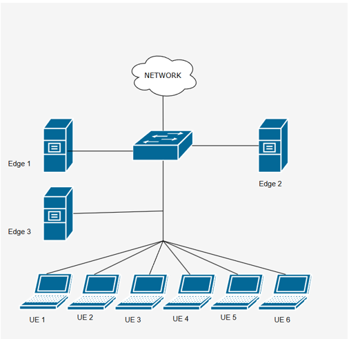

# 📡 Intelligent Task Offloading in Edge Computing using Deep Q-Learning

This project implements an intelligent task offloading mechanism using Deep Q-Learning (DQN) in a simulated edge computing environment. The network is created using Mininet, and a reinforcement learning agent built in PyTorch learns to decide whether to process a task locally or offload it to an edge server based on real-time network conditions and workload.

---

## 🗺️ Network Topology

The custom topology consists of:

- 👥 6 User Equipments (UEs): ue1, ue2, ue3, ue4, ue5, ue6  
- 🖥️ 3 Edge Servers: edge1, edge2, edge3  
- 🔀 1 Switch: s1  
- 🎮 1 Controller: c0  

📡 Bandwidth Configuration:

- UEs ↔ Switch: 10 Mbps  
- Edge Servers ↔ Switch: 100 Mbps  

📷 Topology Diagram:




---

## 🚀 Features

- ✅ Custom Mininet topology for edge computing
- ✅ Deep Q-Network (DQN) implementation using PyTorch
- ✅ Real-time RTT (Round-Trip Time) measurement using ping
- ✅ Dynamic and randomized task generation per UE
- ✅ Reward function based on latency (negative reward = high latency)
- ✅ Experience Replay Buffer for stable training
- ✅ Target Network synchronization for DQN stability
- ✅ CLI-based visualization of task offloading decisions

---

## 🛠️ Prerequisites

Ensure the following software is installed:

- Linux OS (Tested on Ubuntu)
- Python 3.8 or above
- Mininet
- PyTorch
- NumPy

Install dependencies:

```bash```
pip install torch numpy

---
## 🧠 DQN Model Overview

The Deep Q-Network (DQN) makes decisions based on the following inputs and outputs to optimize task offloading in an edge computing environment:

🔢 Input (State):

- RTT to edge1, edge2, and edge3  
- Task Size (range: 1MB to 10MB)  
- CPU Demand (range: 5% to 50%)  

🎯 Output (Action Space):

- 0 → Process Locally  
- 1 → Offload to edge1  
- 2 → Offload to edge2  
- 3 → Offload to edge3  

🎁 Reward Function:

- Reward = −(total latency)  
- Lower latency results in a higher (less negative) reward  

🧮 Model Architecture:

- Input Layer: 5 neurons (3 RTTs + task size + CPU demand)  
- Hidden Layer: 128 neurons (ReLU activation)  
- Output Layer: 4 Q-values (representing expected reward for each action)  

📘 Training Details:

- Total Episodes: 50  
- Tasks per Episode: 6 (one per UE)  
- Target Network Synchronization: Every 10 episodes  
- Experience Replay Buffer: Enabled to stabilize training  

---

## 📊 Result Analysis

- 📉 Latency decreases over episodes as the agent learns optimal offloading strategies.  
- 📈 Edge servers are selected when the combination of RTT and CPU cost is lower than local computation.  
- 🤖 The DQN agent adapts dynamically to varying task sizes and CPU loads.  
- ⚙️ CPU % reflects the computational workload of each task, directly affecting latency for both local and edge execution.
